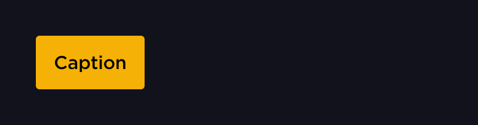
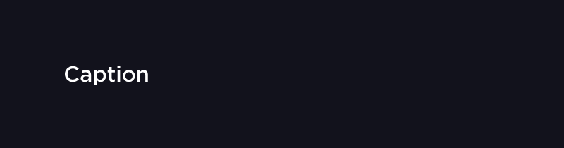
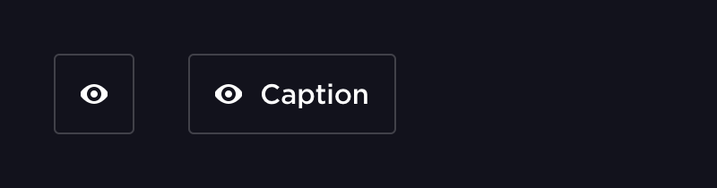
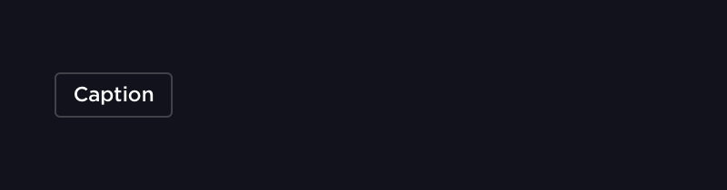
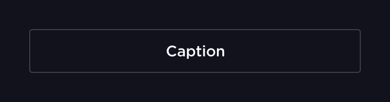
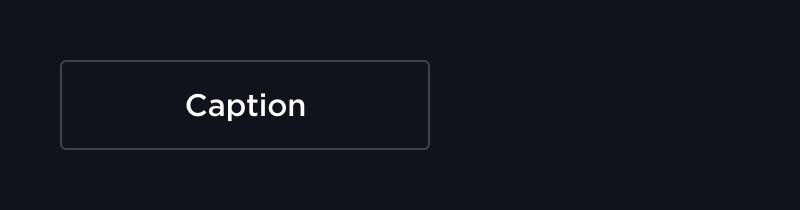
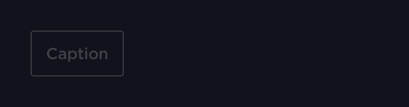

# Кнопка

Кнопки используются для совершения какого либо действия на странице. Это отличает их от ссылок, которые нужны для перехода на другие страницы.

## Параметры

### type *string*

Описывает тип кнопки

#### primary

Кнопка с основным действием, должна быть одна на экране

#### secondary *default*

#### ghost

### icon *string*

Задаёт иконку на кнопке

### height *string*

Задаёт высоту кнопки

#### large

#### small

#### *value*

Высота кнопки в dp

### width *string*

Задаёт ширину кнопки

#### content *default*

Ширина кнопки зависит от текста

#### full

Кнопка занимает 100% родителя по ширине

#### *value*

Ширина кнопки в dp

### id *string*

уникальный id элемента на странице

### loading *boolean*

Заменяет контент кнопки на спиннер

### disabled *boolean*

Переводит кнопку в заблокированное состояние

### url *string*

url для перехода на другую страницу

### theme

Описывает тему контрола

#### dark

#### light
